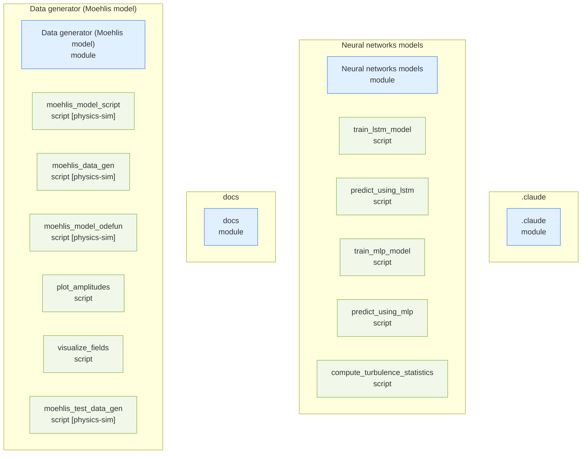
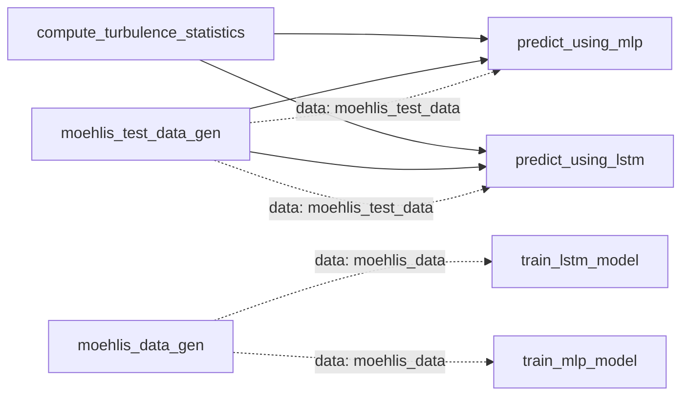

# deep-turbulence — Repository Topology Map

> Auto-generated by `repo-doc-miner/scripts/gen_topology.py` (v2, topology-first). This is the **first deliverable** of the mining process: a structural map of the repository. Refine the detected edges by reading the most important manifests, then deep-dive each module along these edges.

---

## 1. Structural Topology

## 2. Dependency Edges

Solid arrows = `uses`; dotted `... synced` arrows = `source → copy` (single source of truth synced into copies); dotted `"data: <prefix>"`-labeled arrows = `data-contract` (one entity writes a file another loads — no direct import/require between them).

## 3. Entity Inventory

| Kind | Count | Example locations |
| --- | --- | --- |
| script | 11 | `Data generator (Moehlis model)/moehlis_data_gen.m, Data generator (Moehlis model)/moehlis_model_odefun.m, Data generator (Moehlis model)/moehlis_model_script.m` |
| module | 4 | `.claude, Data generator (Moehlis model), Neural networks models` |

## 4. Excluded as Vendored

Dropped-in third-party library copies (matched by directory name or by an embedded package marker such as `setup.py`/`PKG-INFO` next to an `__init__.py`, or a sibling `*.dist-info`/`*.egg-info`) are excluded from every section above — they are not the repo's own code, and their generic `save()`/`load()` methods would otherwise flood the data-contract detector with false positives.

- none detected

## 5. Detected Pipelines

Linear data-contract chains (writer → reader → reader → ...) of 3+ entities, found by following each `data-contract` edge to the end of its chain. Chains of 1-2 edges stay in the Dependency Edges graph above only — not worth a separate diagram.

No data-contract chain of 3+ entities detected. (The 4 data-contract edges above are two independent fan-outs — `moehlis_data_gen` → `{train_mlp_model, train_lstm_model}` and `moehlis_test_data_gen` → `{predict_using_mlp, predict_using_lstm}` — not a chain: none of those four targets is itself a detected writer of another data-contract edge, so no 3-entity sequence exists per the current heuristics.)

## 6. Module Deep-Dive Scaffold

> Walk these modules **along the dependency edges above**, highest complexity first. Replace each `> TODO(doc-miner)` with findings.

### .claude

- **.claude** (module) — `.claude`
  - > TODO(doc-miner): what does .claude do and which entities does it reference?

### Neural networks models

- **Neural networks models** (module) — `Neural networks models`
  - > TODO(doc-miner): what does Neural networks models do and which entities does it reference?
- **train_lstm_model** (script) — `Neural networks models/train_lstm_model.py` (~4 KB)
  - Builds a 1-2 layer Keras LSTM (`seqLen=10` window → 9 amplitudes, `tanh` output), trains on `moehlis_data_100.mat` (`optimizer='adam'`, `loss='mean_squared_error'`), and saves `LSTM1_t100.h5` + `LSTM1_t100_loss.mat`. Consumed by `predict_using_lstm.py`.
- **predict_using_lstm** (script) — `Neural networks models/predict_using_lstm.py` (~2 KB)
  - Loads `LSTM1_t100.h5` and `moehlis_test_data_100.mat`, autoregressively rolls out 10 held-out sequences one state at a time from a `seqLen=10` seed, and writes `LSTM1_t100_ps/series_#.mat` (`testSeq`/`predSeq`) — consumed by `compute_turbulence_statistics.py`.
- **train_mlp_model** (script) — `Neural networks models/train_mlp_model.py` (~4 KB)
  - Builds a 4-hidden-layer Keras MLP (`seqLen=500` flattened window → 9 amplitudes, `tanh` throughout), trains on `moehlis_data_100.mat` (`optimizer='adam'`, `loss='mean_squared_error'`), and saves `MLP3_t100.h5` + `MLP3_t100_loss.mat`. Consumed by `predict_using_mlp.py`.
- **predict_using_mlp** (script) — `Neural networks models/predict_using_mlp.py` (~2 KB)
  - Loads `MLP3_t100.h5` and `moehlis_test_data_100.mat`, autoregressively rolls out 10 held-out sequences from a `seqLen=500` seed, and writes `MLP3_t100_ps/series_#.mat` (`testSeq`/`predSeq`) — consumed by `compute_turbulence_statistics.py`.
- **compute_turbulence_statistics** (script) — `Neural networks models/compute_turbulence_statistics.py` (~4 KB)
  - CLI (`series_dir`, `seqLen`) that reads a folder of `series_#.mat` from `predict_using_{mlp,lstm}.py` and reports two paper metrics: `eps_1` (relative error of amplitude a_1, Eq. 3) and `E_ubar` (relative error of the ensemble-averaged mean streamwise profile, Eq. 4, reconstructed analytically from a_1/a_9 alone). Does not compute `E_{u'^2}`, Reynolds shear stress, skewness, or flatness.

### docs

- **docs** (module) — `docs`
  - > TODO(doc-miner): what does docs do and which entities does it reference?

### Data generator (Moehlis model)

- **Data generator (Moehlis model)** (module) — `Data generator (Moehlis model)`
  - > TODO(doc-miner): what does Data generator (Moehlis model) do and which entities does it reference?
- **moehlis_model_script** (script) — `Data generator (Moehlis model)/moehlis_model_script.m` (~1 KB)
  - Single-run demo: sets `Re=400`, integrates `moehlis_model_odefun` via `ode15s` for one 4000-point series from a fixed initial condition (with a perturbation on mode 4), and calls `visualize_fields` on the result. Not used by any other script — a standalone example.
- **moehlis_data_gen** (script) — `Data generator (Moehlis model)/moehlis_data_gen.m` (~1 KB)
  - Generates `nTS=10` independent 4000-point series via `moehlis_model_odefun`/`ode15s` (random perturbation on mode 4 each run, rejecting laminarized runs where `|a_1-1|<0.01`), and saves `moehlis_data_<nTS>.mat` — the training-data source read by `train_mlp_model.py`/`train_lstm_model.py`.
- **moehlis_model_odefun** (script) — `Data generator (Moehlis model)/moehlis_model_odefun.m` (~2 KB)
  - The nine-equation Moehlis et al. ODE right-hand side (`da(1..9)`, function of `Re` and the domain constants `A,B,C,k1,k2,k3`); called by `moehlis_data_gen.m`, `moehlis_test_data_gen.m`, and `moehlis_model_script.m` via `ode15s`.
- **plot_amplitudes** (script) — `Data generator (Moehlis model)/plot_amplitudes.m` (~4 KB)
  - Plots all 9 amplitude time series `a_1..a_9` as a 5×2 subplot grid with LaTeX-labeled axes. Called (commented out) from `moehlis_model_script.m` as an alternative to `visualize_fields`.
- **visualize_fields** (script) — `Data generator (Moehlis model)/visualize_fields.m` (~4 KB)
  - Reconstructs the 3D velocity field from the 9 amplitudes as a weighted sum of the fixed Fourier modes (`u1x..u9x`, etc.), then plots the mean streamwise profile, a downstream (z-y) cross-section, and a midplane (x-z) slice at a given timestep (`start_t=404`). Called by `moehlis_model_script.m`.
- **moehlis_test_data_gen** (script) — `Data generator (Moehlis model)/moehlis_test_data_gen.m` (~1 KB)
  - Same ODE integration and laminarization filter as `moehlis_data_gen.m`, but seeds the RNG (`rng(12345)`) and generates `nTS=100` series into `moehlis_test_data_<nTS>.mat` — the held-out seed data read by `predict_using_mlp.py`/`predict_using_lstm.py`.

---

> Refine this map, then use it as the backbone for `developer_guide.md`, `user_guide.md`, and `tutorial.md`.