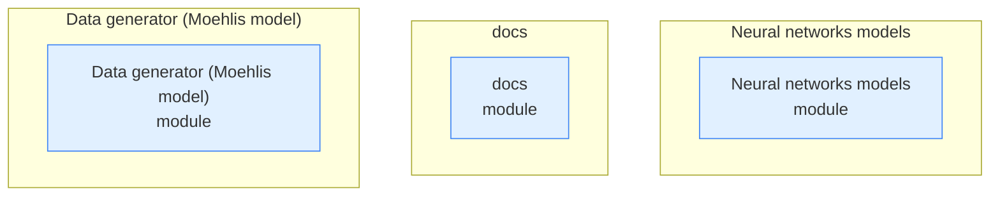
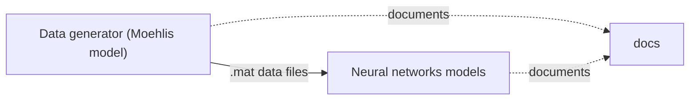

# DeepTurbulence — Repository Topology Map

> Auto-generated by `repo-doc-miner/scripts/gen_topology.py` (v2, topology-first). This is the **first deliverable** of the mining process: a structural map of the repository. Refine the detected edges by reading the most important manifests, then deep-dive each module along these edges.

---

## 1. Structural Topology

## 2. Dependency Edges

Solid arrows = `uses`; dotted arrows = `source → copy` (single source of truth synced into copies).

The auto-generated draft found no edges because MATLAB and Python files never `import`/`require` each other directly — the dependency is a **file-based data contract**, not a code reference: `Data generator (Moehlis model)/moehlis_data_gen.m` writes a `moehlis_data_<nTS>.mat` file (a 3D array `data` of shape `(nTS, nTP, 9)`) that `Neural networks models/train_mlp_model.py` and `train_lstm_model.py` load via `scipy.io.loadmat`. This is the single most important edge in the repository: everything downstream (training, prediction, visualization) depends on the shape and naming convention of this file.

## 3. Entity Inventory

| Kind | Count | Example locations |
| --- | --- | --- |
| module | 3 | `Data generator (Moehlis model), Neural networks models, docs` |

## 4. Module Deep-Dive Scaffold

> Walk these modules **along the dependency edges above**, highest complexity first. Replace each `> TODO(doc-miner)` with findings.

### Data generator (Moehlis model)

- **Data generator (Moehlis model)** (module) — `Data generator (Moehlis model)`
  - Generates the ground-truth turbulence data: MATLAB scripts integrate the nine-equation Galerkin ODE model of Moehlis *et al.* (`moehlis_model_odefun.m`) to produce time series of nine modal amplitudes, either a single series (`moehlis_model_script.m`) or a batch of independent series filtered for laminarization (`moehlis_data_gen.m`), and visualize them (`plot_amplitudes.m`, `visualize_fields.m`). It references no other module — it is the **source of truth** for the `.mat` data consumed by Neural networks models.

### Neural networks models

- **Neural networks models** (module) — `Neural networks models`
  - Trains and runs the predictors: `train_mlp_model.py`/`train_lstm_model.py` build Keras `Sequential` MLP/LSTM models from the `.mat` files produced by Data generator (Moehlis model), and `predict_using_mlp.py`/`predict_using_lstm.py` reload a trained `.h5` model to autoregressively roll out new time series. It references **Data generator (Moehlis model)** as its data source (via `.mat` files) and ships its own `trained_nn_models/` folder of pre-trained weights.

### docs

- **docs** (module) — `docs`
  - Holds the generated documentation set (`docs/guides/`: topology, developer guide, user guide, tutorial) and a local Markdown copy of the reference paper (`docs/references/`). It references both **Data generator (Moehlis model)** and **Neural networks models** as its subject matter — every claim in `docs/guides/` is grounded in a file from one of those two modules — but no code in `docs/` is imported or executed by them.

---

> Refine this map, then use it as the backbone for `developer_guide.md`, `user_guide.md`, and `tutorial.md`.