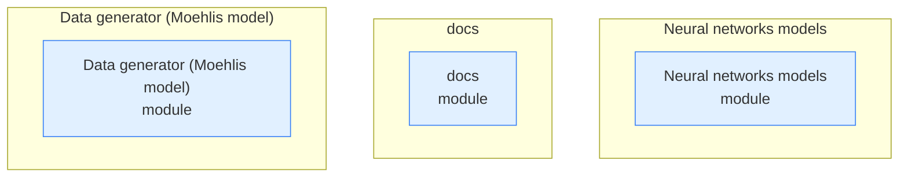

# DeepTurbulence — Repository Topology Map

> Auto-generated by `repo-doc-miner/scripts/gen_topology.py` (v2, topology-first). This is the **first deliverable** of the mining process: a structural map of the repository. Refine the detected edges by reading the most important manifests, then deep-dive each module along these edges.

---

## 1. Structural Topology



## 2. Dependency Edges

Solid arrows = `uses`; dotted arrows = `source → copy` (single source of truth synced into copies).

```mermaid
graph LR
    %% no dependency edges detected
```

## 3. Entity Inventory

| Kind | Count | Example locations |
| --- | --- | --- |
| module | 3 | `Data generator (Moehlis model), Neural networks models, docs` |

## 4. Module Deep-Dive Scaffold

> Walk these modules **along the dependency edges above**, highest complexity first. Replace each `> TODO(doc-miner)` with findings.

### Neural networks models

- **Neural networks models** (module) — `Neural networks models`
  - > TODO(doc-miner): what does Neural networks models do and which entities does it reference?

### docs

- **docs** (module) — `docs`
  - > TODO(doc-miner): what does docs do and which entities does it reference?

### Data generator (Moehlis model)

- **Data generator (Moehlis model)** (module) — `Data generator (Moehlis model)`
  - > TODO(doc-miner): what does Data generator (Moehlis model) do and which entities does it reference?

---

> Refine this map, then use it as the backbone for `developer_guide.md`, `user_guide.md`, and `tutorial.md`.